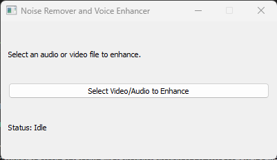

# Noise Removal and Voice Enhancement GUI

A very simple GUI for noise removal and voice enhancement in audio and video files using [DeepFilterNet2](https://github.com/yuguochencuc/DeepFilterNet2).

## Features

- Enhance audio from both standalone audio files and embedded audio in video files.
- Utilizes state-of-the-art deep learning models for noise reduction and voice clarity.

## Demo

Noisy: 

https://github.com/user-attachments/assets/027836db-7b09-41e1-b85d-02fbc0aa827a

Enhanced: 

https://github.com/user-attachments/assets/733be219-1506-4c35-b563-1cb2b7f7cfa2

## Usage
0. First instll rust from https://rustup.rs/
1. **pip install -r requirements-cuda.txt** if you are using cuda enabled nvidia gpu or **pip install -r requirements-cpu.txt** if you want to run it on cpu.
2. download ffmpeg and add to your system path. 
    - go to https://www.gyan.dev/ffmpeg/builds/
    - download a build (i.e. https://www.gyan.dev/ffmpeg/builds/ffmpeg-release-essentials.zip)
    - extract ffmpeg to a folder (i.e. C:/ffmpeg)
    - add ffmpeg.exe folder to system environment variable (i.e. C:/ffmpeg/bin)
3. **Click run.bat** and run the utility with your audio or video file as input.

## References
- [DeepFilterNet2 GitHub Repository](https://github.com/yuguochencuc/DeepFilterNet2)

